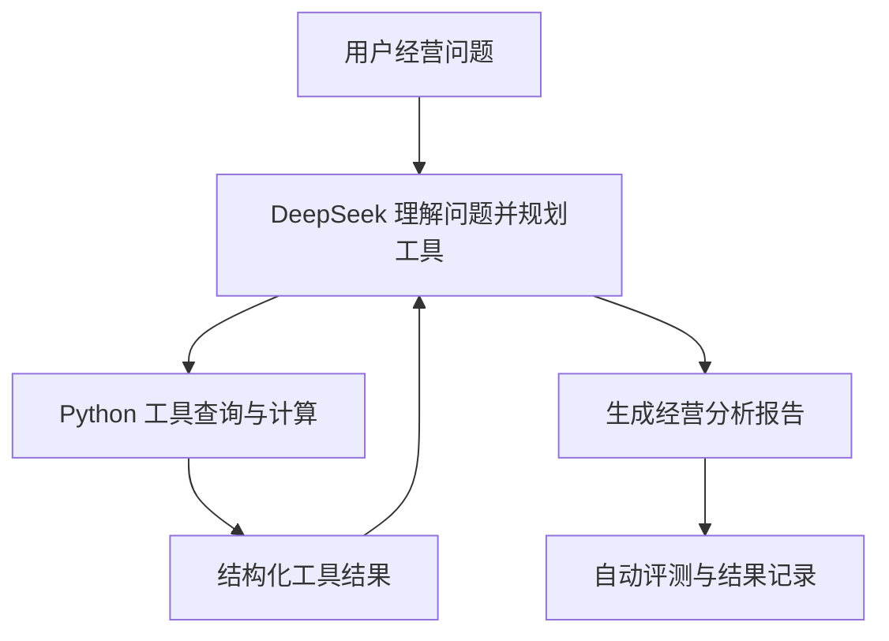

# 电商经营分析 Agent

一个面向电商经营场景的多步骤分析 Agent。系统使用 DeepSeek 进行任务理解与工具规划，通过本地 Python 工具读取和计算结构化经营数据，最终生成包含指标变化、维度拆解和证据说明的分析报告。

> 项目定位：这是一个 **LLM Agent 应用与评测项目**，重点在于工具调用、分析流程编排、异常处理和端到端评测，而不是训练或微调大语言模型。

## 项目背景

电商经营分析经常涉及多个相互关联的问题，例如：

- GMV 为什么下降？
- 哪个渠道或用户分群造成了主要变化？
- CTR、CVR、AOV 和退款率分别发生了什么变化？
- 当前周期与上一周期相比，业务表现如何？

如果完全依赖人工查询和计算，分析过程较为重复；如果只让大模型直接回答，又容易产生没有数据依据的结论。因此，本项目将大语言模型负责的“理解与规划”和 Python 负责的“查询与计算”分开：模型选择工具和组织报告，所有核心指标由确定性的本地工具计算。

## 核心能力

- **单周期经营概览**：汇总 GMV、订单量、买家数、AOV、退款率等指标。
- **跨周期指标对比**：比较本期与上期的指标值、绝对变化和相对变化。
- **维度拆解**：按照类目、渠道或用户分群分析业务表现。
- **漏斗分析**：计算曝光、点击、支付订单、买家数、CTR 和 CVR。
- **多步骤诊断**：根据问题连续调用多个工具，完成“整体变化—维度定位—报告生成”的分析流程。
- **异常处理**：识别无效类目和空日期范围；工具返回 `error` 或 `no_data` 后停止继续调用，避免无意义的二次查询。
- **可观测评测**：记录工具名称、调用参数、执行状态、耗时和 Token 消耗。

## 系统架构



系统采用受控的 Tool Calling（工具调用）循环：

1. 用户输入经营分析问题；
2. DeepSeek 根据工具定义选择所需工具及参数；
3. Python 工具读取 CSV 数据并完成确定性计算；
4. 工具结果返回模型，模型判断是否需要继续查询；
5. 信息充分后生成最终分析报告；
6. 评测器检查工具选择、关键词覆盖、响应耗时和 Token 消耗。

## 工具设计

| 工具函数 | 作用 | 典型问题 |
|---|---|---|
| `get_overview_metrics` | 获取指定日期和筛选条件下的经营概览 | “查看本期美妆类目的整体表现” |
| `compare_periods` | 对比本期与上期的核心经营指标 | “电子类目的 AOV 是否上升？” |
| `compare_dimension_periods` | 对比某一维度各取值在两个周期的表现 | “哪个渠道导致 GMV 下降？” |
| `breakdown_by_dimension` | 按类目、渠道或用户分群进行单周期拆解 | “按渠道拆解本期美妆表现” |
| `get_funnel_metrics` | 计算曝光、点击、支付订单、买家、CTR 和 CVR | “查看本期美妆转化漏斗” |

## 数据与指标

项目使用 `data/ecommerce_metrics.csv` 中的结构化模拟电商经营数据，并通过 `src/generate_data.py` 保证数据可复现。数据包含日期、商品类目、流量渠道、用户分群和多项经营指标。

主要指标包括：

- **GMV（商品交易总额）**：一定周期内成交商品的总金额；
- **AOV（平均订单金额）**：GMV ÷ 支付订单量；
- **CTR（点击率）**：点击量 ÷ 曝光量；
- **CVR（转化率）**：支付订单量 ÷ 点击量；
- **退款率**：退款订单量 ÷ 支付订单量。

指标计算由 Python 工具完成，大模型不负责自行编造或估算核心数值。

## 项目结构

```text
ecommerce-analysis-agent/
├── data/
│   ├── ecommerce_metrics.csv       # 模拟电商经营数据
│   └── ground_truth.json           # 指标计算真值
├── reports/
│   └── evaluation_results.json     # 端到端评测结果
├── src/
│   ├── agent.py                    # Agent循环、工具定义与调用轨迹
│   ├── evaluator.py                # 自动评测与汇总指标
│   ├── generate_data.py            # 模拟数据生成
│   ├── metrics.py                  # 基础指标计算
│   ├── prompts.py                  # 系统提示词与分析约束
│   └── tools.py                    # 本地分析工具
├── tests/
│   ├── evaluation_cases.json       # 端到端评测用例
│   ├── test_generate_data.py       # 数据生成测试
│   ├── test_metrics.py             # 指标计算测试
│   └── test_tools.py               # 工具功能测试
├── .env.example                    # 环境变量示例
├── .gitignore                      # Git忽略规则
├── main.py                         # 命令行入口
├── requirements.txt                # Python依赖
└── README.md
```

## 快速开始

### 1. 创建并激活 Python 环境

推荐使用 Python 3.11：

```powershell
conda create -n agent-demo python=3.11 -y
conda activate agent-demo
```

### 2. 安装依赖

```powershell
pip install -r requirements.txt
```

### 3. 配置 DeepSeek API

复制 `.env.example` 为 `.env`，并填写自己的 API Key。不要将真实 Key 提交到 GitHub。

```text
DEEPSEEK_API_KEY=your_api_key
DEEPSEEK_BASE_URL=https://api.deepseek.com
DEEPSEEK_MODEL=your_model_name
```

### 4. 启动 Agent

```powershell
python main.py
```

可测试的问题示例：

```text
Why did Beauty GMV decline in the current period?
```

## 测试与评测

### 自动化单元测试

```powershell
python -m pytest -v
```

单元测试覆盖数据生成、指标计算、非法数值、除零保护、工具输出、无效筛选条件和空数据范围等场景。

### 端到端 Agent 评测

运行全部评测用例：

```powershell
python -m src.evaluator
```

只运行一个指定用例：

```powershell
python -m src.evaluator --case beauty_gmv_diagnosis
```

评测器读取 `tests/evaluation_cases.json`，逐题调用 Agent，并将完整结果写入 `reports/evaluation_results.json`。

## 当前评测结果

本地最终运行结果：

| 评测项目 | 结果 |
|---|---:|
| 自动化单元测试 | 18 / 18 通过 |
| 端到端评测用例 | 9 / 9 通过 |
| Case Pass Rate（用例通过率） | 100% |
| Task Completion Rate（任务完成率） | 100% |
| Tool Selection Accuracy（工具选择准确率） | 100% |
| Required Tool Recall（必要工具召回率） | 100% |
| Required Term Recall（必要关键词召回率） | 100% |
| Average Latency（平均响应时间） | 6.815 秒 |
| Total Tokens（9题累计 Token） | 55,583 |

端到端用例覆盖：多步骤 GMV 诊断、AOV 对比、退款率对比、渠道 CVR 对比、单周期概览、漏斗分析、渠道拆解、无效类目和空日期范围。

### 评测指标说明

- **任务完成率**：Agent 是否成功返回非空分析报告；
- **工具选择准确率**：实际工具名称和调用次数是否与预期完全一致；
- **必要工具召回率**：完成任务所要求的工具调用是否全部出现；
- **必要关键词召回率**：报告是否包含评测用例要求的关键证据词；
- **平均响应时间**：完成一道端到端用例的平均耗时；
- **累计 Token**：多轮模型请求中输入与输出 Token 的累计消耗。

## 关键改进案例

第一轮评测中，无效类目 `Books` 用例出现了额外工具调用：模型在收到错误后继续查询可用类目。项目随后进行了两项修复：

1. 取消类目参数的封闭枚举限制，将用户输入原样交给 Python 工具验证；
2. 当工具返回 `error` 或 `no_data` 时，下一轮强制生成最终答复，禁止继续调用工具。

修复后，该用例只调用一次 `get_overview_metrics`，完整端到端评测由 8/9 提升到 9/9。

## 项目边界与局限

- 当前使用模拟 CSV 数据，尚未连接真实数据仓库或实时指标服务；
- 现有 9 个端到端用例能够验证核心链路，但规模仍然有限；
- 关键词召回只能检查必要信息是否出现，不能完全替代对数值正确性和因果表述的人工审核；
- 大模型输出具有一定随机性，评测结果可能受到模型版本、提示词和网络状态影响；
- 当前版本主要用于项目验证，尚未实现生产环境所需的权限控制、缓存、监控和并发治理。

## 后续方向

- 扩充困难样本和边界场景，按问题类型统计分组指标；
- 增加报告数值与工具结果的一致性校验；
- 引入规则评测与 LLM-as-a-Judge（大模型评审）相结合的报告质量评估；
- 对接真实电商数据源，并增加权限控制、缓存和调用成本监控；
- 将命令行交互扩展为可视化分析界面。

## 安全说明

`.env` 用于保存真实 API Key，并已通过 `.gitignore` 排除。仓库只应提交不含真实密钥的 `.env.example`。
